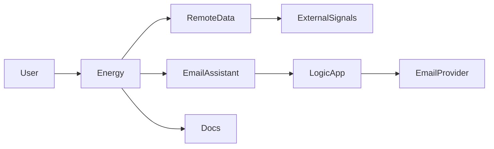

# Foundry Demo — persisted AI agents (C#)

This repository is a compact demo that hosts AI "agents" in a .NET app and shows how to persist, update, and orchestrate agents at runtime.
# Foundry Agents - C# project scaffold

This workspace contains a scaffold for building AI Foundry agents in C#.
# Foundry Demo — persisted AI agents (C#)

A compact demo that hosts AI "agents" in a .NET app and shows how to persist and update agents at runtime. It includes three demo agents used by the sample flows:

- Energy — produces a JSON "GlobalEnvelope" and a small plot
- RemoteData — a small data-fetching agent that uses an OpenAPI-backed tool to provide data to other agents
- EmailAssistant — posts an email request to an Azure Logic App (invoked via a host-provided LogicAppTool using AAD tokens)

Keep this repo lightweight: agent instructions are stored under `Agents/<Agent>/` (markdown), and runtime artifacts (agent ids, thread mappings) are persisted under `Agents/` and intentionally ignored by git.

## Quick overview
- Host: `src/Foundry.Agents` — the .NET console/worker that creates and runs agents
- Persisted data: `Agents/<Agent>/agent-id.txt` and `Agents/<Agent>/threads.json`
- Tools: OpenAPI-backed HTTP tool (see `src/ExternalSignals.Api`) used by `RemoteData`, and a Logic App helper that uses Azure AD (DefaultAzureCredential)

## What this demo shows
- Create and persist agents so they can be updated in-place (no recreate required)
- Use a connected-agent pattern for multi-agent orchestration(Energy → RemoteData, EmailAssistant)
- Use OpenAPI (Azure Function) as tool for RemoteData; EmailAssistant uses the LogicAppTool with AAD tokens
- Invoke a Logic App, as a tool, securely with AAD tokens from an agent (EmailAssistant)

## Quick start (local)
Prereqs:
- .NET 8 SDK
- Git
- (Optional) Azure CLI + az login for Logic App AAD testing


Start the ExternalSignals API (Function) first

The `RemoteData` agent uses the local OpenAPI server in `src/ExternalSignals.Api`. Start that function before launching the host so `RemoteData` can call it.

From the repo root (PowerShell):

```powershell
cd src/ExternalSignals.Api
# If you have Azure Functions Core Tools installed:
func start
# Or, if the project is a regular .NET app:
dotnet run
```

Note the HTTP base URL printed by the function host (usually `http://localhost:7071`). Then, in the same PowerShell session set the `OpenApi:BaseUrl` for the host so the `RemoteData` tool points to your local function:

## Top-level agents in this demo

- Energy — single entry point for the scenario; produces a GlobalEnvelope JSON and small plot outputs
- RemoteData — data-fetching agent that calls a local OpenAPI-backed tool (ExternalSignals)
- Compute — a lightweight compute helper used by the Orchestrator
- Report — simple summarizer that produces a report JSON
- EmailAssistant — posts a normalized email envelope to an Azure Logic App

Important project layout
- Host: `src/Foundry.Agents` — the console/worker that creates and runs agents and wires DI
- Agents: `src/Foundry.Agents/Agents/` (Energy, RemoteData, Compute, Report, EmailAssistant, Orchestrator)
- Persisted artifacts: `Agents/<Agent>/agent-id.txt` and `Agents/<Agent>/threads.json` (intentionally ignored by git)
- External tool (local OpenAPI Function): `src/ExternalSignals.Api`
- Logic App helper: `src/Foundry.Agents/Tools/LogicApp/LogicAppTool.cs`

What’s new / notable
- Orchestrator: an in-process workflow orchestration (uses the Microsoft.Agents.AI.Workflows preview runtime) that pipes data from `RemoteData` → `Compute` → `Report` and can optionally trigger `EmailAssistant`.
  - Executor IDs are agent-centric (PascalCase): `RemoteData`, `Compute`, `Report` for traceability.
  - The Orchestrator builds FunctionExecutor instances at runtime and executes the workflow with InProcessExecution.
- EmailAssistant: implemented to invoke Azure Logic Apps using `DefaultAzureCredential` and returns a strict JSON envelope ({ status: "ok"|"needs_input"|"error" }).

Requirements and notes
- .NET SDK: .NET 9 is available in CI here and used for experiments with the Workflows preview; the projects target net9.0 in this branch to support the preview packages. Keep that in mind if your environment only has .NET 8.
- Workflows preview: this repo experiments with `Microsoft.Agents.AI.Workflows` (preview). The preview API is evolving — the Orchestrator uses FunctionExecutor<object> and IWorkflowContext.YieldOutputAsync to interop with the runtime.
- Logic Apps & AAD: `EmailAssistant` uses `DefaultAzureCredential` to obtain tokens for audience `https://logic.azure.com/.default`. Locally, run `az login` so DefaultAzureCredential can fetch tokens. Ensure your Logic App is configured to accept AAD tokens (APIM/EasyAuth or an AAD-aware front door) or use a secure alternative.

Quick start (local)
Prereqs:
- .NET SDK (9.x recommended for the preview experiments) or at least the SDK versions installed in your dev environment
- Git
- (Optional) Azure CLI (`az`) + `az login` for Logic App token testing

1) Start the ExternalSignals API (if you want `RemoteData` to call a local tool):

From the repo root (PowerShell):

```powershell
cd src/ExternalSignals.Api
# If this project is an Azure Functions app and you have func tools installed:
func start
# Otherwise:
dotnet run
```

Note the base URL (e.g. `http://localhost:7071`) and set it in your host session if needed:

```powershell
#$env:OpenApi__BaseUrl = 'http://localhost:7071'
```

2) Build and run the host

From the repo root:

```powershell
dotnet restore
dotnet build foundry-demo-take4.sln -c Debug
dotnet run --project src/Foundry.Agents
```

3) Run tests

```powershell
dotnet test tests/Foundry.Agents.Tests/Foundry.Agents.Tests.csproj -c Debug --no-build
```

Configuration
- Set these values in `appsettings.Development.json` or environment variables:

```json
{
  "Project": {
    "Endpoint": "https://your-persistent-agents-endpoint",
    "ModelDeploymentName": "your-model-deployment"
  },
  "OpenApi": {
    "BaseUrl": "http://localhost:7071" // local ExternalSignals.Api
  },
  "LogicApp": {
    "BaseUrl": "https://<region>.logic.azure.com/workflows/<id>/triggers/When_a_HTTP_request_is_received/paths",
    "InvokePath": "/invoke",
    "ApiVersion": "2016-10-01"
  }
}
```

Tips and operational notes
- Persisted artifacts live under `Agents/`. You can edit `Agents/<Agent>/agent-id.txt` to pin an agent id or delete it to force recreation.
- Large agent instructions are stored as markdown files under `Agents/<Agent>/` and are loaded by the host at runtime — prefer keeping long templates in markdown rather than in code.
- The Workflows preview used by the Orchestrator is experimental. If you upgrade the preview package, re-check handler signatures (FunctionExecutor and IWorkflowContext) as the preview API may change.

Security reminder
- Do not commit secrets or credentials. Use environment variables or `appsettings.Development.json` excluded from source control.

Contact / next steps
- If you want, I can add unit tests that mock `RemoteDataAgent` / `ComputeAgent` / `ReportAgent` and validate the Orchestrator's envelope output. I can also add a small integration script that runs a canned Orchestrator scenario and writes the output to `docs/`.
```

Quick start (host)

Commands (from repo root):

```powershell
dotnet restore
dotnet build foundry-demo-take4.sln -c Debug
dotnet test tests/Foundry.Agents.Tests/Foundry.Agents.Tests.csproj -c Debug --no-build
# Ensure ExternalSignals.Api is running and OpenApi__BaseUrl is set in this session, then:
dotnet run --project src/Foundry.Agents
```

The host reads `appsettings.json` and environment variables. Do NOT commit secrets.

## Minimum configuration
Set these values in `appsettings.json` or environment variables:

- `Project:Endpoint` — URL for the Persistent Agents service (required at runtime)
- `Project:ModelDeploymentName` — model deployment id used when creating agents

Logic App (EmailAssistant) configuration (only if you plan to send email via Logic App):
- `LogicApp:BaseUrl` — e.g. `https://<region>.logic.azure.com/workflows/<id>/triggers/When_a_HTTP_request_is_received/paths`
- `LogicApp:InvokePath` — typically `/invoke`
- `LogicApp:ApiVersion` (default `2016-10-01`) and query params (`Sv`, `Sp`) may be required depending on your Logic App URL

Auth notes:
- The agent uses `DefaultAzureCredential` to request a token for audience `https://logic.azure.com/.default`. Locally, sign in with `az login` so the credential can obtain tokens.
- Ensure the Logic App endpoint accepts AAD tokens (configure APIM / Easy Auth or place an AAD-aware front door) — otherwise use a different secure connector.

## Sample prompts and expected outcomes

- Energy demo (start via host-run):
  - Prompt (example): "Run the energy demo for 24 hours and return the GlobalEnvelope JSON with measures and a human summary."
  - Expected outcome: host creates an Energy run, the assistant returns a GlobalEnvelope JSON that is saved to `docs/last_agent_output.json` and a small plot PNG is written to `docs/energy_measures_<timestamp>.png`.

- EmailAssistant (callable by other agents or messages):
  - Input (example JSON):
    {
      "email_to": "alice@example.com; bob@example.com",
      "subject": "Energy report",
      "body": "Please find the latest energy summary attached.",
      "attachments": []
    }
  - Expected outcome: the agent normalizes recipients and posts a JSON envelope to the configured Logic App. The agent returns a strict JSON envelope indicating status: `ok`, `needs_input`, or `error`.

IMPORTANT: RemoteData and EmailAssistant are intended to be used as tool/connected agents that the Energy agent calls. Do not call `RemoteData` or `EmailAssistant` directly from external code or user input — use the Energy agent as the single entry point for the demo flows. Calling them directly can bypass orchestration and thread-management that Energy provides.

- External OpenAPI (tool used by RemoteData): `src/ExternalSignals.Api`
- Agents: `src/Foundry.Agents/Agents/` (Energy, RemoteData, EmailAssistant)
- Host and DI: `src/Foundry.Agents/Program.cs`
- Logic App helper: `src/Foundry.Agents/Tools/LogicApp/LogicAppTool.cs`

## Flow diagram


Legend:
- Energy: single entry point for the demo — the Energy agent orchestrates the run, calls RemoteData and EmailAssistant, and writes outputs
- RemoteData: data agent (calls ExternalSignals OpenAPI / Function)
- ExternalSignals: local OpenAPI Function used as a tool by RemoteData
- EmailAssistant: agent that calls a Logic App to send email
- LogicApp: Azure Logic App receiving requests from EmailAssistant
- Docs: output files such as `docs/last_agent_output.json` and PNGs

## Notes and tips
- Persisted artifacts (agent ids and threads) live under `Agents/` — you can edit `Agents/<Agent>/agent-id.txt` to pin an existing agent id or remove it to recreate.
- Large agent instructions are stored as markdown under `Agents/<Agent>/` (the host loads instructions at runtime). Keep long, multi-language templates out of .cs files.
- If you plan to use Logic Apps, test AAD token acquisition locally with:
  - `az login`
  - `az account get-access-token --resource https://logic.azure.com/`


appsettings.json.example
```json
{
  "Project": {
    "Endpoint": "https://your-persistent-agents-endpoint",
    "ModelDeploymentName": "your-model-deployment"
  },
  "OpenApi": {
    "BaseUrl": "http://localhost:7071" // for local ExternalSignals.Api
  },
  "LogicApp": {
    "BaseUrl": "https://<region>.logic.azure.com/workflows/<id>/triggers/When_a_HTTP_request_is_received/paths",
    "InvokePath": "/invoke",
    "ApiVersion": "2016-10-01"
  }
}


Notes
- The README includes the example `appsettings.json` above so you can copy it into `appsettings.Development.json` (do not commit secrets).

## Agent framework workflow (run lifecycle)

This section explains how the demo's agent framework runs and where local runtime artifacts are persisted. It helps developers understand thread/message/run lifecycle, why `thread-<id>.lock` files appear, and how to keep the repo clean.

### 1) Core lifecycle (single run)
- Prepare a stable run id and thread id: the Orchestrator or host builds a `thread_id` (run-scoped) and passes it to agents — agents echo the same `thread_id` so outputs are traceable.
- Create a user message: the host uses the Persistent Agents SDK to create a message in the agent's thread (Messages.CreateMessageAsync).
- Start a run: the host invokes Runs.CreateRunAsync(threadId, agentId, ...) which kicks off the agent execution on the service.
- Poll/watch the run: the client can poll Runs.GetRunAsync or stream events (WatchStreamAsync) to receive AgentRunUpdateEvent fragments and the final assembled output.

### 2) Thread mapping and locks (local behavior)
- Thread mapping: the demo persists a mapping at `Agents/<Agent>/threads.json` that stores agentId → threadId so demos reuse the same thread and preserve history.
- File locks: to avoid concurrent processes manipulating the same thread, the host creates a file lock named `thread-<threadId>.lock` in the agent folder while a run is active. The lock is removed when the run completes. Stale lock files can be removed safely when no process is running.

### 3) Local runtime artifacts (what you will see)
- `Agents/<Agent>/agent-id.txt` — persisted agent id (if created locally). The repo ignores these files.
- `Agents/<Agent>/threads.json` — mapping of agentId → threadId (ignored by git).
- `Agents/*/thread-<id>.lock` — temporary lock files created during runs (ignored by git). Remove stale locks manually if necessary.
- `run-outputs/` — orchestrator run artifacts (raw event arrays, per-stage outputs like `{runId}.remoteData.json` and `{runId}.energy.json`, `{runId}.final.json`, and an events log). These are persisted for debugging and are ignored by git.

### 4) Why generated files show up in `git status`
If you run the host locally before updating `.gitignore`, agent runtime artifacts (agent-id, threads.json, run-outputs, thread locks) may appear as changed files. To avoid this:

- Add these patterns to `.gitignore` (the repo already contains many of them):

```text
Agents/*/agent-id.txt
Agents/*/threads.json
Agents/*/thread-*.lock
run-outputs/
```

- If those files were accidentally committed, stop tracking them but keep them on disk:

```powershell
git rm --cached "Agents/*/agent-id.txt" "Agents/*/threads.json"
git commit -m "chore: stop tracking agent runtime artifacts"
```

### 5) Quick cleanup commands
- Remove stale lock files:

```powershell
Get-ChildItem -Path .\Agents -Filter "thread-*.lock" -Recurse | Remove-Item -Force
```

- Remove run-outputs and other generated directories (only if you don't need the artifacts):

```powershell
Remove-Item -Recurse -Force .\run-outputs, .\workflows-decomp, .\asminspect -ErrorAction SilentlyContinue
```

### 6) Developer tips
- To capture the exact payload sent to the Persistent Agents service (for diagnosing array_above_max_length or message-splitting issues), enable HTTP logging in the SDK or route traffic through a local proxy (Fiddler/mitmproxy) and capture the POST payload containing `messages[0].content`.
- To avoid content splitting across many fragments, serialize structured runtime objects into a single JSON string before forwarding them to downstream agents.

If you want, I can add a small `tools/cleanup.ps1` script that removes runtime artifacts and optionally zips `run-outputs/` for evidence submission.
