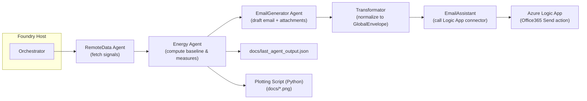

# Foundry Demo — persisted AI agents (C#)

This repository demonstrates persisted AI "agents" hosted in a .NET app and a small in-process Orchestrator that runs a sequential agent pipeline and captures final outputs.

What you'll find
- `src/Foundry.Agents` — the host and DI wiring; the console app that builds and runs agents
- `src/Foundry.Agents/Agents` — agent wrappers and the `Orchestrator` implementation
- `Agents/` — agent instruction markdown and runtime persisted artifacts (ignored by git)
- `docs/` — orchestrator outputs (e.g. `last_agent_output.json`) and generated plots
- `tests/` — unit tests

High-level behavior
- The host creates-or-fetches persisted agents (RemoteData, Energy, etc.) using the Persistent Agents SDK.
- `Orchestrator` runs a sequential pipeline (RemoteData -> Energy) via an in-process workflow and streams events; the final assembled output is captured in-memory.
- When the Energy output is present, it is pretty-printed to `docs/last_agent_output.json` and a plotting script (Python) is invoked to produce a PNG under `docs/`.

Architecture diagram
The following Mermaid flowchart shows the runtime sequence and handoffs between agents and the Transformator that normalizes generator outputs before the EmailAssistant calls the Logic App connector.



How it works (short)
- Orchestrator runs a sequential pipeline of persisted agents. Agents are created once and reused across runs (agent ids persisted under `Agents/`).
- `RemoteData` returns hourly arrays (24 values) required by `Energy`.
- `Energy` runs a deterministic calculation (via the Code Interpreter snippet in the instructions) and returns a single JSON `GlobalEnvelope` with `data.measures`, `data.baseline`, and `data.optimized`.
- `EmailGenerator` drafts an email and includes inline attachments (small images encoded as base64). It must return plain JSON in a single assistant message per the agent contract.
- `Transformator` normalizes heterogeneous outputs into a canonical envelope (array `email_to`, top-level `email_to_str`, `email_subject`, `email_body_html`, and `attachments`) and enforces inline-only attachments (omits oversized ones and records diagnostics).
- `EmailAssistant` accepts the canonical envelope and calls a deployed Azure Logic App (Office365 connector) to send the email. The Logic App expects a string recipient; the Transformator provides a top-level `email_to_str` to reduce mismatches.

How to run
1. Build and run the host (powershell):

```powershell
dotnet restore
dotnet build foundry-demo-take4.sln -c Debug

# Configure the persistent agents endpoint and model deployment
$env:PROJECT_ENDPOINT='https://persistent-agents-proj-resource.services.ai.azure.com/api/projects/persistent-agents-proj'
$env:MODEL_DEPLOYMENT_NAME='gpt-4o'
# optional test variables used by examples
$env:TEST_ZONE='SE3'; $env:TEST_CITY='Stockholm'; $env:TEST_DATE='2025-10-01';
$env:TEST_USER_REQUEST="Compute a deterministic baseline and three energy-saving measures for zone SE3 in Stockholm on 2025-10-01. Send the summary by email to you@example.com."

dotnet run --project src/Foundry.Agents --configuration Debug
```

2. After a successful run, check `docs/last_agent_output.json` for the energy GlobalEnvelope and `docs/` for any generated plot PNGs.

Troubleshooting tips
- If emails fail to send or recipient fields appear empty in Logic App runs, inspect the orchestrator logs to see the exact normalized JSON the `Transformator` produced (the orchestrator logs the envelope before invoking `EmailAssistant`). Look for `email_to`, `email_to_str`, and `attachments` fields.
- When using Logic Apps, the deployed workflow may need the `isArray(...)` guard when composing the To field. The repo contains a fixed spec under `Tools/OpenApi/logicapp_apispec.json`, but changes must be applied to the live workflow in the Azure Portal or via CI to take effect.
- Large attachments are intentionally omitted by Transformator to enforce inline-only attachments; check the `diagnostics` field in the normalized envelope for omitted items.

Developer notes
- Agent instructions live under `Agents/<Agent>/` (e.g. `Agents/Energy/EnergyInstructions.md`) and define strict single-message JSON contracts. Follow those contracts when adapting or adding agents.
- To add a new agent to the orchestrator sequence, implement the agent instructions file under `Agents/<NewAgent>/` and update `OrchestratorAgent` to include it in the pipeline.

Quick run (recommended)
1. Build the solution and run the host (use environment variables or `appsettings.*.json` for configuration):

```powershell
dotnet restore
dotnet build foundry-demo-take4.sln -c Debug

# Configure PROJECT_ENDPOINT and any other env vars required, then:
dotnet run --project src/Foundry.Agents
```

2. After a successful run the orchestrator will write `docs/last_agent_output.json` and may create `docs/energy_measures_<timestamp>.png` when Energy output is available.

Configuration
- `Project:Endpoint` — persistent agents service endpoint
- `Project:ModelDeploymentName` — model deployment id (when creating agents)

Notes
- Agent instruction markdown is stored in `Agents/<Agent>/` and is loaded at runtime by the host. Runtime artifacts (agent ids and temporary run locks) are intentionally ignored by git.
- The repository previously contained step-by-step instructions for running local tool servers (ExternalSignals.Api). The current focus is on the persisted-agent workflow and the Orchestrator; if you still want to run a local ExternalSignals service, start it separately and set `OpenApi:BaseUrl`.

Testing

```powershell
dotnet test tests/Foundry.Agents.Tests/Foundry.Agents.Tests.csproj -c Debug --no-build
```
